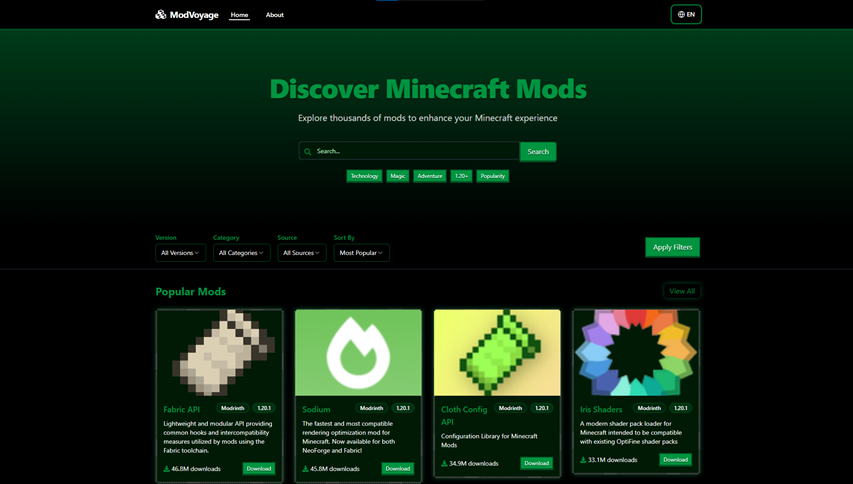
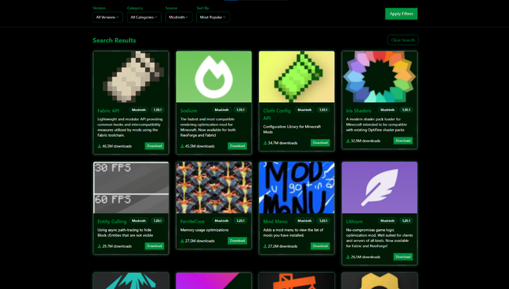
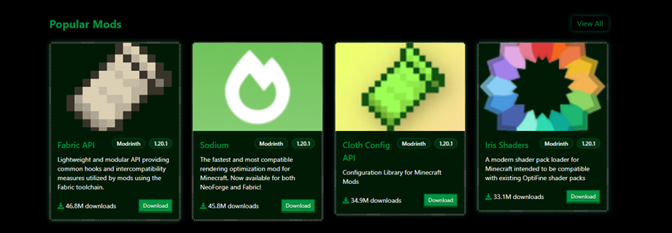
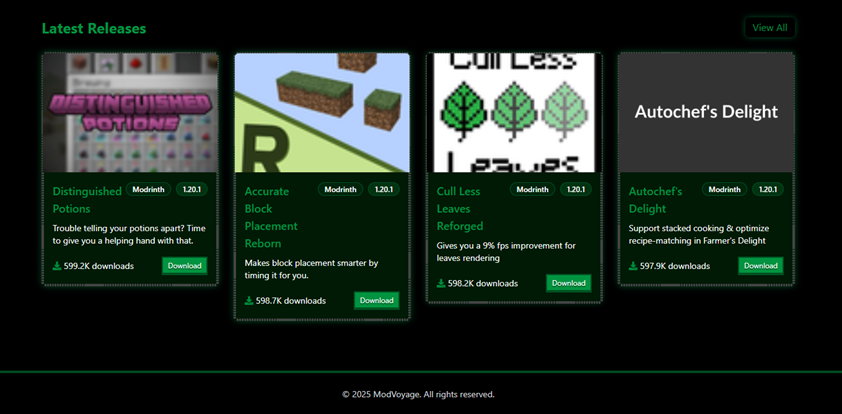
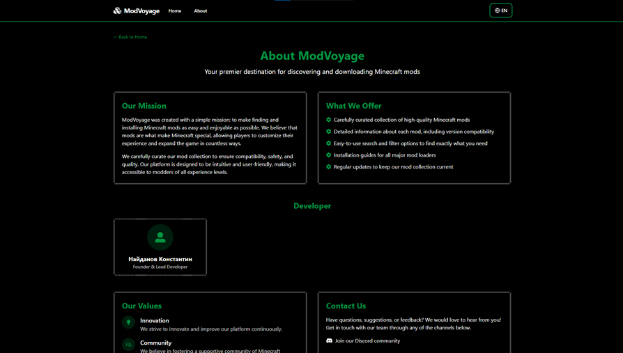
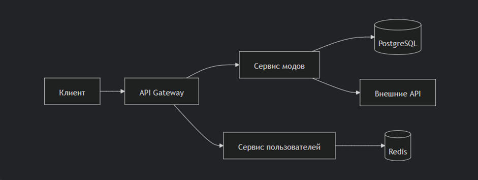

# ModVoyage

## Руководство пользователя

Главная страница ModVoyage – это удобный и интуитивно понятный интерфейс для поиска и изучения модификаций Minecraft.  
Она разработа-на так, чтобы пользователи могли быстро находить нужные моды, знакомиться с новыми релизами и популярными сборками.

Главная страница  
  
В верхней части страницы расположены:  
– Вкладка "Главная" – возвращает на стартовую страницу;  
– Вкладка "О нас" – содержит информацию о проекте и команде;  
– Переключатель языка – позволяет выбрать русский или английский интерфейс.

Поисковая строка  
  
Поисковая строка занимает видное место в верхней части главной страницы:  
– Введите название или ключевые слова для поиска мода;  
– Под поисковой строкой находятся быстрые фильтры популярных категорий и версий.

Поиск модификаций по фильтрам  
  
Поиск и фильтрация. Для их уточнения используются параметры:  
– Version – выбор версии Minecraft (1.20, 1.19 и др.);  
– Category – категории модов (техника, магия, декорации и т. д.);  
– Source – источник (CurseForge, Modrinth);  
– Sort By – сортировка (по популярности, дате, рейтингу).

Раздел популярные моды  


Раздел последние релизы  


Вкладка "О нас" предоставляет пользователям основную информа-цию о проекте ModVoyage, его целях и возможностях.  
Этот раздел поможет вам понять концепцию сервиса, узнать о преимуществах платформы.  


## Руководство программиста
Настоящее руководство предназначено для разработчиков, участву-ющих в разработке, сопровождении и модификации веб-приложения  
"ModVoyage" - платформы для поиска и управления модификациями для игры Minecraft. Документ содержит полное описание архитектуры  
системы, API, базы данных, а также практические рекомендации по работе с кодом.

ModVoyage представляет собой полноценное веб-приложение, состоящее из:
– Клиентской части (frontend) на React;  
– Серверной части (backend) на Node.js;  
– Базы данных PostgreSQL;  
– Системы кеширования Redis;  
– Внешних интеграций с API мод-платформ.

Схема взаимодействия  


#### Установка  
Клонируем репозиторий
```
git clone https://github.com/Jejik-ne-ejik/ModVoyage
```

Установка зависимостей
```
# Установка Node.js (если не установлен)
# В проекте используется Node.js v20

# Установка всех зависимостей из package.json
npm install

# Или для чистой установки
npm ci
```

Основные команды для разработки
```
# Запуск приложения в режиме разработки
npm run dev

# Проверка типов TypeScript
npm run check

# Обновление схемы базы данных
npm run db:push

# Сборка для продакшена
npm run build

# Запуск в продакшене
npm run start
```

#### Основные скрипты и их функциональность
1. Серверная часть

Инициализация сервера (server/index.ts)
```
// 1. Создается Express приложение
const app = express();

// 2. Настраиваются middleware 
app.use(express.json());
app.use(session({...})); // Настройка сессий 
app.use(passport.initialize());
app.use(passport.session());

// 3. Регистрируются маршруты API
const server = await registerRoutes(app);

// 4. Настраивается Vite для разработки
await setupVite(app, server);

// 5. Запускается сервер на порту 5000
server.listen({
  port: 5000,
  host: "0.0.0.0",
  reusePort: true
});

// 6. Запускается автоматический парсинг данных
await initializeAutoParsing();
```

Маршруты API (server/routes.ts)  
Основные эндпоинты:
```
// Аутентификация
app.post("/api/auth/register", async (req, res) => {...})
app.post("/api/auth/login", async (req, res) => {...})
app.get("/api/auth/user", async (req, res) => {...})

// Получение данных о модах
app.get("/api/versions", async (req, res) => {...})
app.get("/api/categories", async (req, res) => {...})
app.get("/api/mods/popular", async (req, res) => {...})
app.get("/api/mods/latest", async (req, res) => {...})
app.get("/api/mods/:id", async (req, res) => {...})
app.get("/api/mods", async (req, res) => {...})

// Взаимодействие с модами
app.post("/api/mods/:id/download", async (req, res) => {...})

// Парсинг модов (admin-функционал)
app.get("/api/parse/curseforge", async (req, res) => {...})
app.get("/api/parse/modrinth", async (req, res) => {...})
app.get("/api/parse/modrinth/page/:page", async (req, res) => {...})
app.get("/api/parse/all", async (req, res) => {...})
```

Хранилище данных (server/storage.ts, server/dbStorage.ts)
```
// Интерфейс хранилища определяет все методы работы с данными
export interface IStorage {
  // Методы для работы с пользователями
  getUser(id: number): Promise<User | undefined>;
  getUserByUsername(username: string): Promise<User | undefined>;
  createUser(user: InsertUser): Promise<User>;
  
  // Методы для работы с модами
  getMod(id: number): Promise<Mod | undefined>;
  getMods(params?: {...}): Promise<PaginatedResult<Mod>>;
  getPopularMods(limit?: number): Promise<Mod[]>;
  getLatestMods(limit?: number): Promise<Mod[]>;
  createMod(mod: InsertMod): Promise<Mod>;
  incrementDownloadCount(id: number): Promise<Mod | undefined>;
  clearMods(): Promise<void>;
  
  // Методы для работы с категориями
  getCategories(): Promise<Category[]>;
  getCategory(id: number): Promise<Category | undefined>;
  getCategoryByName(name: string): Promise<Category | undefined>;
  createCategory(category: InsertCategory): Promise<Category>;
  clearCategories(): Promise<void>;
  
  // Методы для работы с версиями Minecraft
  getMinecraftVersions(): Promise<MinecraftVersion[]>;
  createMinecraftVersion(version: InsertMinecraftVersion): Promise<MinecraftVersion>;
}

// Реализации: MemStorage (in-memory) и DbStorage (PostgreSQL)
```

Парсеры модов (server/services/parser.ts)
```
// 1. Парсинг CurseForge
export async function parseCurseForge(limit: number = 100): Promise<ModParsingResult> {
  // Запрос к официальному API CurseForge
  // Трансформация данных в формат InsertMod
}

// 2. Парсинг Modrinth
export async function parseModrinth(limit: number = 500): Promise<ModParsingResult> {
  // Постраничный запрос к API Modrinth
  // Трансформация данных в формат InsertMod
}

// 3. Парсинг отдельной страницы Modrinth
export async function parseModrinthPage(page: number = 1, limit: number = 20): Promise<ModParsingResult> {
  // Запрос определенной страницы с API Modrinth
}

// 4. Объединенный парсинг из всех источников
export async function parseAllSources(limit: number = 100): Promise<ModParsingResult> {
  // Вызов всех парсеров и объединение результатов
}
```

Автоматический парсинг (server/services/autoParser.ts)
```
// Проверяем наличие API ключей
const hasCurseForgeKey = Boolean(process.env.CURSEFORGE_API_KEY);
const hasModrinthKey = Boolean(process.env.MODRINTH_API_KEY);

if (!hasCurseForgeKey) {
    log('Warning: CURSEFORGE_API_KEY not found in environment variables. CurseForge parsing might fail.', 'autoParser');
}

if (!hasModrinthKey) {
    log('Warning: MODRINTH_API_KEY not found in environment variables. Modrinth parsing might fail.', 'autoParser');
}

log('Starting auto-parsing to populate data with real API data', 'autoParser');

// Парсим данные из всех источников
const result = await parseAllSources(20); // Получаем до 20 модов из каждого источника
```

2. Клиентская часть

Инициализация приложения (client/src/main.tsx)
```
// Подключение React Query для работы с данными
createRoot(document.getElementById("root")!).render(
  <QueryClientProvider client={queryClient}>
    <App />
    <Toaster />
  </QueryClientProvider>
);
```

Роутинг (client/src/App.tsx)
```
function RouterContent() {
  return (
    <Switch>
      <Route path="/" component={Home} />
      <Route path="/mod/:id" component={ModDetail} />
      <Route path="/categories" component={Categories} />
      <Route path="/category/:id" component={CategoryDetail} />
      <Route path="/about" component={About} />
      <Route path="/versions" component={Versions} />
      <Route path="/admin" component={AdminPanel} />
      <Route component={NotFound} />
    </Switch>
  );
}
```

Контексты (client/src/contexts/*)  
LanguageContext - Мультиязычная поддержка:
```
interface LanguageContextType {
  language: 'en' | 'ru';
  setLanguage: (lang: 'en' | 'ru') => void;
  t: (key: string, params?: Record<string, any>) => string;
}
```

Компоненты страниц (client/src/pages/*):  
– Home - Главная страница со списком модов, поиском и фильтрами  
– ModDetail - Детальная информация о выбранном моде  
– Categories - Список категорий модов  
– CategoryDetail - Список модов в выбранной категории  
– Versions - Список версий Minecraft

UI компоненты (client/src/components/*)  
1.Структурные компоненты:  
– Navbar - Навигационная панель  
– Footer - Подвал страницы  
– AuthDialog - Диалог авторизации и регистрации  
2.Компоненты для главной страницы:  
– HeroSearch - Панель поиска в шапке страницы  
– FilterSection - Панель фильтров  
– ModCard - Карточка мода  
– CategoryCard - Карточка категории